# 🏨 Hostel Management System — System Design

> **Project:** Smart Hostels — VIT Hostel Management System  
> **Stack:** Java 21 + Spring Boot 3.4 (Backend) · React + Vite (Frontend) · MySQL (DB)  
> **Deployment:** Netlify (Frontend) · Docker (Backend)

---

## Table of Contents

1. [High-Level Design (HLD)](#high-level-design-hld)
   - [System Overview](#1-system-overview)
   - [Technology Stack](#2-technology-stack)
   - [Deployment Architecture](#3-deployment-architecture)
   - [User Roles & Capabilities](#4-user-roles--capabilities)
   - [Core Module Map](#5-core-module-map)
2. [Low-Level Design (LLD)](#low-level-design-lld)
   - [Database Schema](#6-database-schema-er-diagram)
   - [Backend Package Structure](#7-backend-package-structure)
   - [Security & Authentication Flow](#8-security--authentication-flow)
   - [API Endpoints](#9-api-endpoints)
   - [Service Layer Interaction](#10-service-layer-interaction)
   - [Room Booking — Sequence Diagram](#11-room-booking-sequence-diagram)
   - [Complaint Lifecycle](#12-complaint-lifecycle)
   - [Frontend Architecture](#13-frontend-architecture)
   - [Frontend Route Map](#14-frontend-route-map)
   - [Axios Interceptor Flow](#15-axios-interceptor-flow)

---

## High-Level Design (HLD)

### 1. System Overview

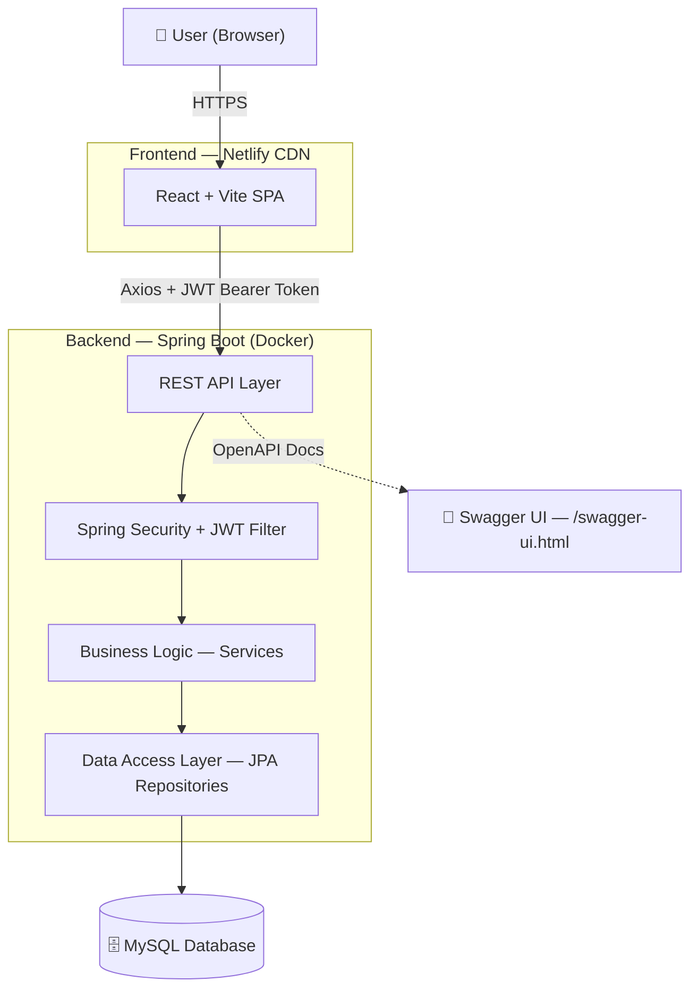

---

### 2. Technology Stack

| Layer                | Technology                          | Purpose                               |
| -------------------- | ----------------------------------- | ------------------------------------- |
| **Frontend**         | React 18 + Vite                     | SPA, fast HMR builds                  |
| **Routing**          | React Router DOM                    | Client-side routing                   |
| **HTTP Client**      | Axios (with interceptors)           | API calls + token injection           |
| **State**            | React Context API                   | Global user state                     |
| **Backend**          | Spring Boot 3.4 (Java 21)           | REST API server                       |
| **Security**         | Spring Security + JWT (jjwt 0.12.6) | Stateless auth                        |
| **ORM**              | Spring Data JPA + Hibernate         | Database abstraction                  |
| **Database**         | MySQL                               | Relational persistence                |
| **API Docs**         | SpringDoc OpenAPI (Swagger)         | Auto-generated REST docs              |
| **Build Tool**       | Maven                               | Backend build & dependency management |
| **Containerization** | Docker                              | Backend packaging                     |
| **Frontend Hosting** | Netlify                             | CDN deployment                        |

---

### 3. Deployment Architecture

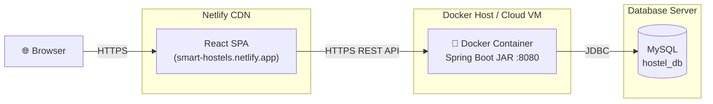

---

### 4. User Roles & Capabilities

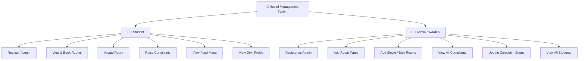

---

### 5. Core Module Map

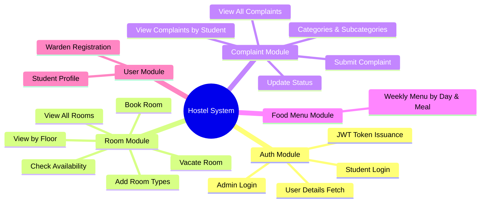

---

## Low-Level Design (LLD)

### 6. Database Schema (ER Diagram)

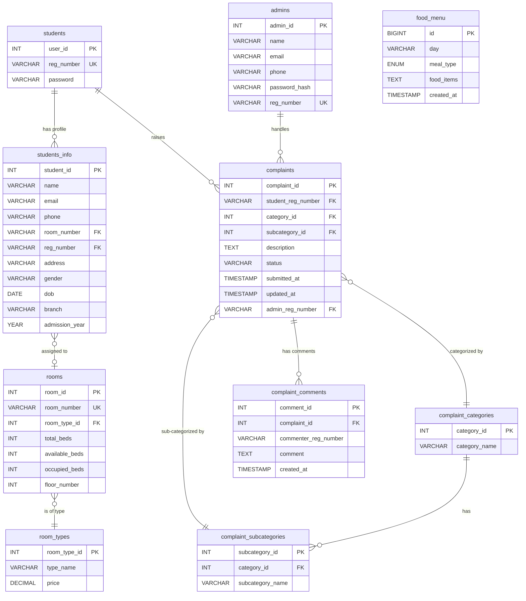

---

### 7. Backend Package Structure

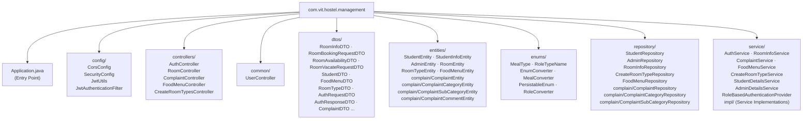

---

### 8. Security & Authentication Flow

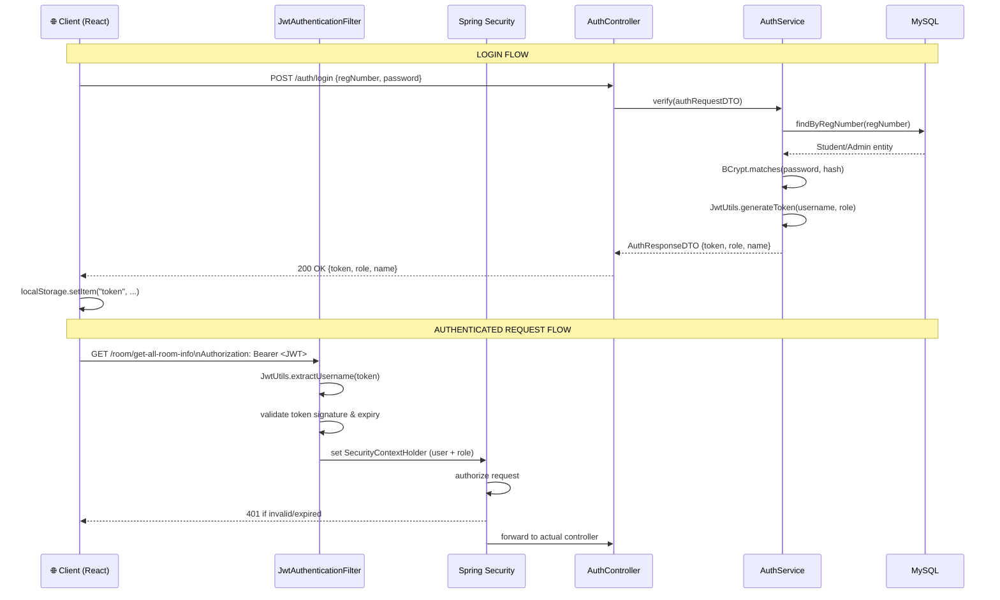

---

### 9. API Endpoints

#### Auth Controller — `/auth`

| Method | Endpoint                     | Description                 | Auth   |
| ------ | ---------------------------- | --------------------------- | ------ |
| `POST` | `/auth/login`                | Login and get JWT           | Public |
| `POST` | `/auth/signup-student`       | Register student            | Public |
| `POST` | `/auth/signup-admin`         | Register admin              | Public |
| `POST` | `/auth/user-details`         | Get user details from token | Public |
| `POST` | `/auth/student-full-details` | Get student by reg number   | Public |

#### Room Controller — `/room`

| Method | Endpoint                                  | Description                    | Auth   |
| ------ | ----------------------------------------- | ------------------------------ | ------ |
| `GET`  | `/room/get-all-room-info`                 | All rooms                      | 🔒 JWT |
| `GET`  | `/room/get-rooms-by-floor-number/{floor}` | Rooms by floor                 | 🔒 JWT |
| `GET`  | `/room/get-total-floors`                  | Total floor count              | 🔒 JWT |
| `GET`  | `/room/availability/{roomNumber}`         | Live bed availability          | 🔒 JWT |
| `GET`  | `/room/my-booking/{regNumber}`            | Student's current booking      | 🔒 JWT |
| `POST` | `/room/add-room-info`                     | Add single room (Admin)        | 🔒 JWT |
| `POST` | `/room/add-multiple-rooms-info`           | Bulk add rooms (Admin)         | 🔒 JWT |
| `PUT`  | `/room/book-room`                         | Book room (Pessimistic Lock)   | 🔒 JWT |
| `PUT`  | `/room/vacate-room`                       | Vacate room (Pessimistic Lock) | 🔒 JWT |

#### Complaint Controller — `/complain`

| Method | Endpoint                                           | Description             | Auth   |
| ------ | -------------------------------------------------- | ----------------------- | ------ |
| `GET`  | `/complain/get-all-complaint-categories`           | All categories          | 🔒 JWT |
| `GET`  | `/complain/get-all-complaint-subcategories`        | All subcategories       | 🔒 JWT |
| `GET`  | `/complain/get-all-complaints`                     | All complaints (Admin)  | 🔒 JWT |
| `GET`  | `/complain/get-complain-detailsById/{id}`          | Complaint by ID         | 🔒 JWT |
| `GET`  | `/complain/complain/get-complaints-by-regno/{reg}` | By student              | 🔒 JWT |
| `POST` | `/complain/add-complaint`                          | Submit complaint        | 🔒 JWT |
| `PUT`  | `/complain/update-complaint`                       | Update complaint status | 🔒 JWT |

#### Food Menu Controller — `/food`

| Method | Endpoint              | Description      | Auth   |
| ------ | --------------------- | ---------------- | ------ |
| `GET`  | `/food/get-food-menu` | Weekly food menu | 🔒 JWT |

#### Room Types Controller — `/room-types`

| Method | Endpoint                              | Description              | Auth   |
| ------ | ------------------------------------- | ------------------------ | ------ |
| `GET`  | `/room-types/get-all-room-types`      | All room types           | 🔒 JWT |
| `GET`  | `/room-types/get-roomType-by-id/{id}` | Room type by ID          | 🔒 JWT |
| `POST` | `/room-types/add-room-type`           | Create room type (Admin) | 🔒 JWT |

---

### 10. Service Layer Interaction

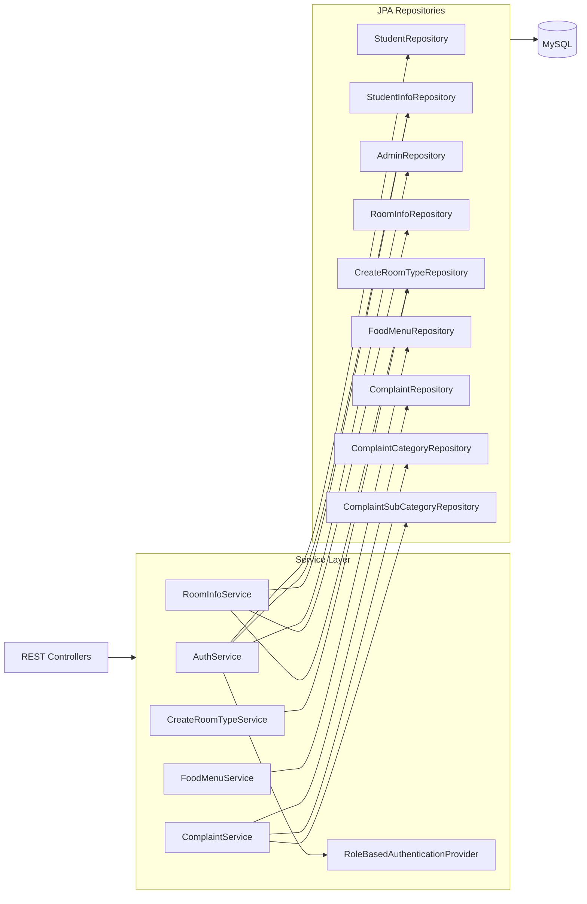

---

### 11. Room Booking — Sequence Diagram

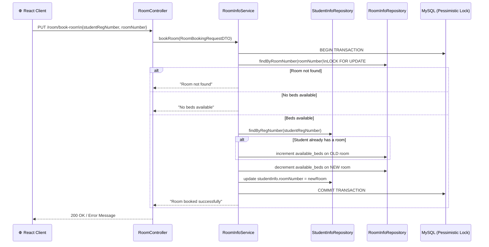

---

### 12. Complaint Lifecycle

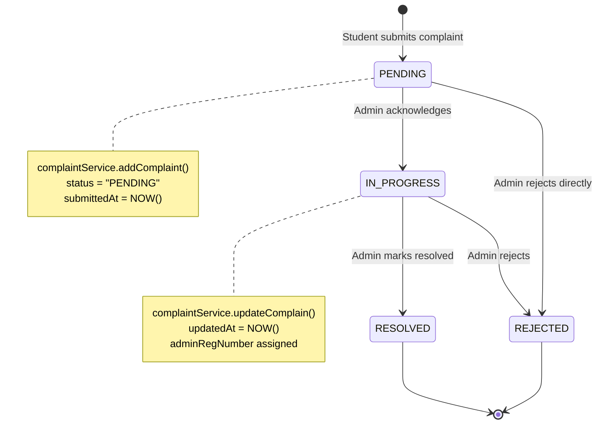

---

### 13. Frontend Architecture

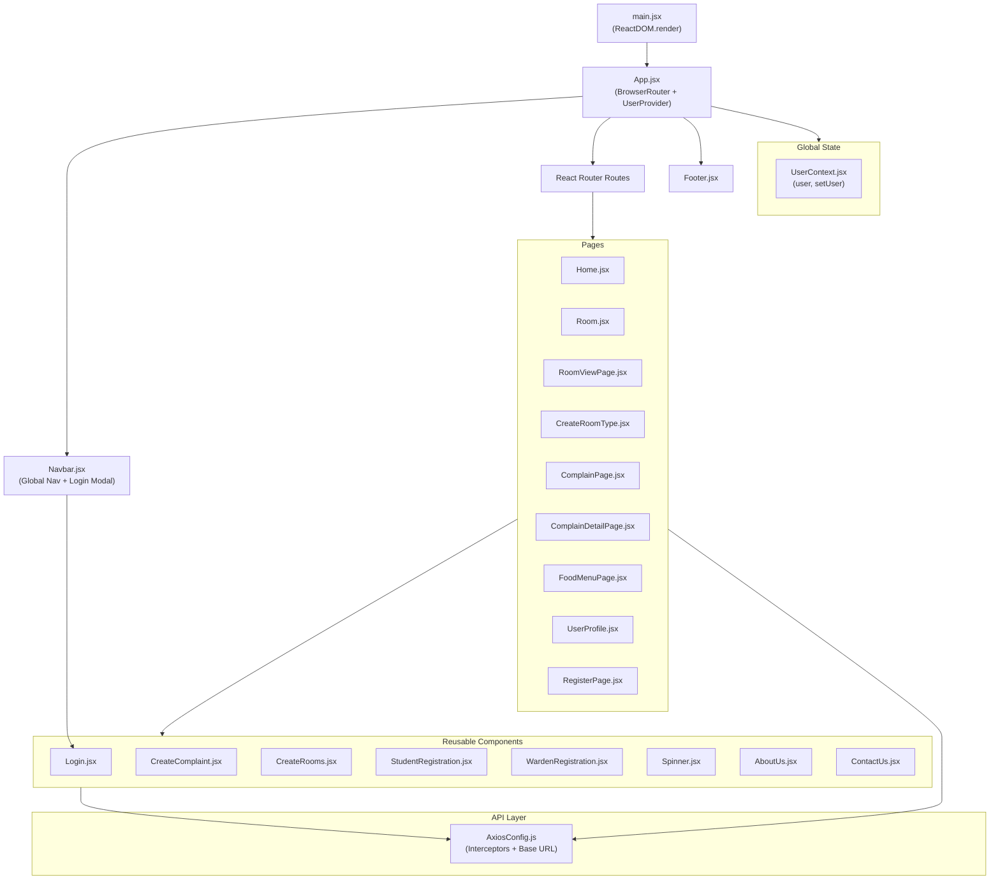

---

### 14. Frontend Route Map

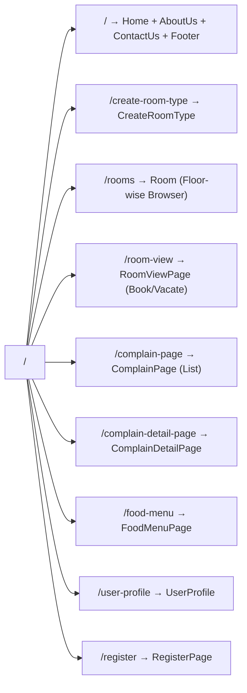

---

### 15. Axios Interceptor Flow

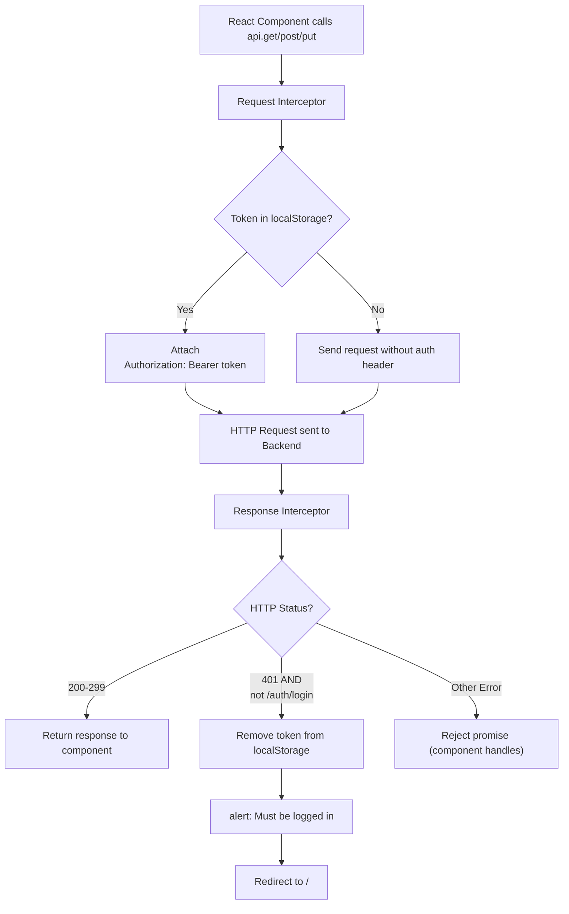

---

## Summary

| Aspect                 | Detail                                                        |
| ---------------------- | ------------------------------------------------------------- |
| **Architecture Style** | Layered MVC (Backend) + SPA (Frontend)                        |
| **Auth Mechanism**     | Stateless JWT, BCrypt password hashing                        |
| **DB Strategy**        | JPA/Hibernate with Pessimistic Locking for concurrent booking |
| **API Documentation**  | Auto-generated via SpringDoc OpenAPI (Swagger UI)             |
| **CORS Policy**        | Whitelisted: localhost:5173 + smart-hostels.netlify.app       |
| **Global State**       | React Context (UserContext)                                   |
| **Error Handling**     | Global 401 interceptor on Axios                               |
| **Containerization**   | Docker (backend), Netlify CI/CD (frontend)                    |
